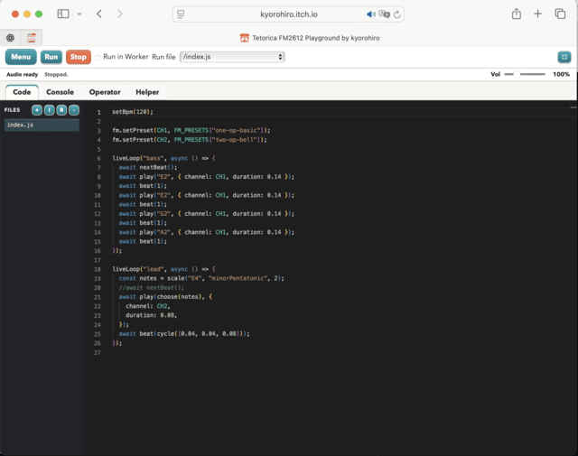

FM synthesis can be difficult at first.
It asks you to learn both parameter design and performance technique.

The Sega Genesis / Mega Drive is a retro game console, but it includes the YM2612,
a 4-operator, 6-channel FM sound chip.
Compared with modern synth setups, that may look small, but it created a huge amount of memorable music and sound.

A lot of that know-how still survives in VGM files made and preserved by enthusiasts.
By reading and replaying them, we can study how people actually used the chip and how they shaped its sound.

With Tetorica, we prepared an environment where you can try it directly from JavaScript.
If that sounds interesting, let&apos;s keep going.

[Tetorica FM2612 Playground](https://kyorohiro.github.io/hello_ymfm_wasm/playground/index.html)

Playground VGM import also saves OPN FM key-on timbres as virtual files such as
`/presets/song/ym2612_ch1_001.tfi` and adds them to the Operator Preset list.
Repeated timbres within each channel are deduplicated; importing the same filename
again uses a new folder (`song-2`, etc.). TFI stores static FM parameters, not
pan, LFO, or pitch/volume automation.

# Tetorica FM2612 (hello_ymfm_wasm)

This repository has four goals:

- To understand the YM2612 chip.
- To create documentation that helps anyone understand the YM2612 chip.
- To create documentation that helps anyone embed YM2612 audio in a browser app or game.
- To preserve older game music and sound chip technology as cultural heritage that people today can read, investigate, learn from, and reconstruct—not only archive and play back.

## What this repository provides

- YM2612 WebAssembly builds and JavaScript wrappers for browser-side use
- a reusable `Playground(...)` runtime layer for browser games and app embedding
- a browser playground for trying YM2612 control and live coding from JavaScript
- a browser synth app for hands-on YM2612 sound design
- a VGM analyzer for playback, inspection, and patch extraction, including YM2610 / YM2610B FM, SSG and ADPCM-A/B playback from embedded VGM ROM blocks

## Download

Release files are available here:

- WebAssembly (wasm) builds for YM2612
- JavaScript wrappers for browser-side use
- browser demos and app-style tools

- [https://github.com/kyorohiro/hello_ymfm_wasm/releases](https://github.com/kyorohiro/hello_ymfm_wasm/releases)

GitHub Releases is the primary download entry point for packaged wasm and browser-side runtime files.

## Try it in the browser

You can try the WebAssembly build, the JavaScript wrapper, and the browser tools directly in the published pages.
This is the easiest way to test YM2612 control, sound design, and Genesis-oriented VGM analysis without setting up the full build flow first.

- Main page:
  [https://kyorohiro.github.io/hello_ymfm_wasm/](https://kyorohiro.github.io/hello_ymfm_wasm/)
- Sega Genesis / Mega Drive YM2612 FM Introduction with JavaScript:
  [https://kyorohiro.github.io/hello_ymfm_wasm/introductions/index.html](https://kyorohiro.github.io/hello_ymfm_wasm/introductions/index.html)
- Playground:
  [https://kyorohiro.github.io/hello_ymfm_wasm/playground/index.html](https://kyorohiro.github.io/hello_ymfm_wasm/playground/index.html)
- Playground Runtime Embedded Demo:
  [https://kyorohiro.github.io/hello_ymfm_wasm/demos/playground_runtime.html](https://kyorohiro.github.io/hello_ymfm_wasm/demos/playground_runtime.html)
- Synth:
  [https://kyorohiro.github.io/hello_ymfm_wasm/synth/index.html](https://kyorohiro.github.io/hello_ymfm_wasm/synth/index.html)
- VGM Analyzer:
  [https://kyorohiro.github.io/hello_ymfm_wasm/vgm_analyzer/index.html](https://kyorohiro.github.io/hello_ymfm_wasm/vgm_analyzer/index.html)

## Try it on itch.io

- [https://kyorohiro.itch.io](https://kyorohiro.itch.io)

## License and Attribution

This repository uses the BSD 3-Clause License for both the upstream ymfm-derived parts and the original files added in this project.
It uses [ymfm](https://github.com/aaronsgiles/ymfm) by Aaron Giles, and this repository also includes original work by kyorohiro under the same BSD 3-Clause License.
This repository includes the license text in `LICENSE`, and the packaged release files also include `LICENSE`.

The following files and directories in this repository are ymfm-originated works:

- `src/` except `src/segapsg.h` and `src/segapsg.cpp`
- `examples/`
- [GeneralInfo.md](https://github.com/aaronsgiles/ymfm/blob/main/GeneralInfo.md)

### MAME RF5C164 (`third_party/mame-rf5c164/`)

The RF5C164 PCM engine used for Mega-CD / Sega CD VGM playback is adapted from
[MAME's RF5C68 / RF5C164 implementation](https://github.com/mamedev/mame/blob/d0f1c15a0f6df2dd51a754cb46e6175b7079c8f2/src/devices/sound/rf5c68.cpp)
by Olivier Galibert and Aaron Giles. The adapted core and its generated
`rf5c164_wasm.wasm` build use the **BSD 3-Clause License**.
See [the license](third_party/mame-rf5c164/LICENSE) and
[source and adaptation notes](third_party/mame-rf5c164/README.md).
Packages containing this engine include these notices under `licenses/mame-rf5c164/`.

### Nuked-OPN2 (`third_party/nuked-opn2/`)

`third_party/nuked-opn2/` vendors [Nuked-OPN2](https://github.com/nukeykt/Nuked-OPN2)
by Alexey Khokholov (Nuke.YKT), via [kyorohiro/Nuked-OPN2](https://github.com/kyorohiro/Nuked-OPN2)
(a pinned fork). It is an **optional, experimental alternate YM2612 engine**
you can switch to with `?engine=nuked` on the Playground, Synth, and VGM
Analyzer pages, alongside the default ymfm-based engine.

Unlike the rest of this repository, `third_party/nuked-opn2/` (and the
`nuked_opn2_wasm.wasm` build produced from it) is licensed under the
**GNU Lesser General Public License v2.1 or later**, not BSD 3-Clause. See
`third_party/nuked-opn2/LICENSE` and `third_party/nuked-opn2/README.md` for
details. It is not included in the packaged release/embed builds
(`scripts/package_*.sh`), so anyone embedding only the default ymfm build is
unaffected.

### Sonic Pi sample assets (`docs/playground/samples/sonic-pi/`)

The audio files in `docs/playground/samples/sonic-pi/` are sample assets from
[Sonic Pi](https://github.com/sonic-pi-net/sonic-pi), used by the Playground for
sample playback and experiments. They are separate from the Tetorica source
code and are documented as **CC0 1.0** by Sonic Pi. See the upstream
[license](https://github.com/sonic-pi-net/sonic-pi/blob/stable/LICENSE.md),
[sample documentation](https://github.com/sonic-pi-net/sonic-pi/blob/stable/etc/samples/README.md),
and the local [sample notes](docs/playground/samples/sonic-pi/README.md).

## Links

- `ymfm` repository:
  - https://github.com/aaronsgiles/ymfm
- `Nuked-OPN2` (original, and the pinned fork vendored in `third_party/nuked-opn2/`):
  - https://github.com/nukeykt/Nuked-OPN2
  - https://github.com/kyorohiro/Nuked-OPN2
- `MAME`:
  - https://www.mamedev.org/
- `retropc.net`:
  - http://retropc.net/cisc/m88/
- `ymfm` examples:
  - https://github.com/aaronsgiles/ymfm/tree/main/examples
- `libymfm.wasm`:
  - https://github.com/h1romas4/libymfm.wasm
- `ymfm` source for YM2612 registers and behavior:
  - `src/ymfm_opn.h`
  - `src/ymfm_opn.cpp`
- YM2612 pin reference:
  - http://www.chipdir.nl/pinusr/ym2612.txt
- YM2612 overview:
  - https://www.vgmpf.com/Wiki/index.php?title=YM2612
- Genesis development discussion and practical notes:
  - https://gendev.spritesmind.net/forum/viewtopic.php?start=585&t=386
- YM2612 music uploads:
  - https://chipmusic.org/music#s=ym2612
- GENajam:
  - https://github.com/jamatarmusic/GENajam
- megatoy:
  - https://github.com/ulalume/megatoy
- Maple's Garden article:
  - https://another.maple4ever.net/archives/3027/
- Aidan Lawrence's Sega Genesis video game music player:
  - https://www.aidanlawrence.com/hardware-sega-genesis-video-game-music-player/
- VGM specification:
  - https://vgmrips.net/wiki/VGM_Specification
- SMS Power:
  - https://www.smspower.org/
