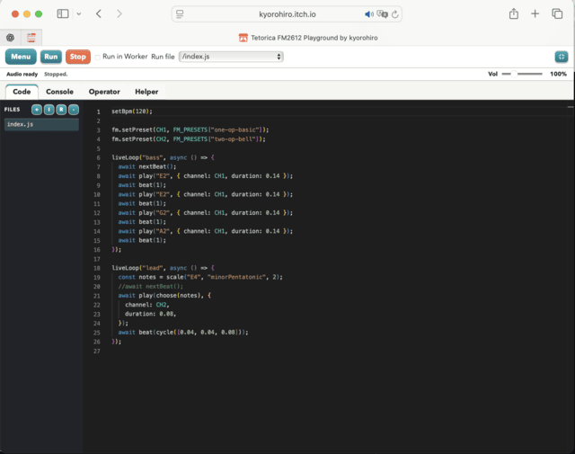

# Tetorica FM2612 (hello_ymfm_wasm)

[English](README.md) | [日本語](README.ja.md) | [AI/SI](READMD.ai.md)

Tetorica is a tool for live coding retro game sounds in JavaScript, including
the sounds of the Sega Genesis / Mega Drive and Game Boy.

This project includes:

- `tetorica-fm2612`: an npm package for controlling retro game sound chips from JavaScript.
- `tetorica-vgm`: an npm package for analyzing retro game VGM files.
- A browser-based synthesizer app for extracting instruments from VGM files and trying them immediately.
- A browser-based Playground app for live coding with an API inspired by Sonic Pi.
- A browser-based analyzer app for inspecting and playing VGM files.



[Tetorica FM2612 Playground](https://kyorohiro.github.io/hello_ymfm_wasm/playground/index.html)

## Project goals

This repository has four goals:

- To understand the YM2612 chip.
- To create documentation that helps anyone understand the YM2612 chip.
- To create documentation that helps anyone embed YM2612 audio in a browser app or game.
- To preserve older game music and sound chip technology as cultural heritage that people today can read, investigate, learn from, and reconstruct—not only archive and play back.

## Feature status

[機能対応状況 / Feature status](docs/feature-status.md): implementation coverage, verification records, limitations and release status across Analyzer, CLI and Playground.

See [Memo.md](Memo.md#chip-playback-notes-english) for chip-specific playback details, limitations and implementation notes.

## Try it in the browser

You can try the WebAssembly build, the JavaScript wrapper, and the browser tools directly in the published pages.
This is the easiest way to test YM2612 control, sound design, and Genesis-oriented VGM analysis without setting up the full build flow first.

- Main page:
  [https://kyorohiro.github.io/hello_ymfm_wasm/](https://kyorohiro.github.io/hello_ymfm_wasm/)
- Sega Genesis / Mega Drive YM2612 FM Introduction with JavaScript:
  [https://kyorohiro.github.io/hello_ymfm_wasm/introductions/index.html](https://kyorohiro.github.io/hello_ymfm_wasm/introductions/index.html)
- Playground:
  [https://kyorohiro.github.io/hello_ymfm_wasm/playground/index.html](https://kyorohiro.github.io/hello_ymfm_wasm/playground/index.html)
- Playground Runtime Embedded Demo:
  [https://kyorohiro.github.io/hello_ymfm_wasm/demos/playground_runtime.html](https://kyorohiro.github.io/hello_ymfm_wasm/demos/playground_runtime.html)
- Synth:
  [https://kyorohiro.github.io/hello_ymfm_wasm/synth/index.html](https://kyorohiro.github.io/hello_ymfm_wasm/synth/index.html)
- VGM Analyzer:
  [https://kyorohiro.github.io/hello_ymfm_wasm/vgm_analyzer/index.html](https://kyorohiro.github.io/hello_ymfm_wasm/vgm_analyzer/index.html)

[VGM Analyzer sound chip support and limitations](https://kyorohiro.github.io/hello_ymfm_wasm/vgm_analyzer/support.html)

## npm packages

### tetorica-fm2612

[`tetorica-fm2612`](https://www.npmjs.com/package/tetorica-fm2612) lets you control retro game sound chips from JavaScript. Use it for browser playback or PCM/WAV generation in Node.js.

```sh
npm install tetorica-fm2612
```

Selected supported chips:

| Family | Chips |
| --- | --- |
| Yamaha OPN | YM2203, YM2608, YM2610 / YM2610B, YM2612 |
| Yamaha OPM | YM2151 |
| Yamaha OPL | YM2413, YM3812, YMF262 |
| PSG and console audio | AY8910, Sega PSG, Game Boy APU, NES APU + FDS, HuC6280 |
| PCM and ADPCM | RF5C164, Sega PCM, OKIM6258, OKIM6295 |

This browser example plays C4, D4 and E4 on the YM2612. Use a setup such as Vite that resolves npm module imports, then click the button.

```js
import {createSoundChip} from 'tetorica-fm2612';
import {YM2612Synth, YM2612WorkletTransport} from 'tetorica-fm2612/ym2612synth.js';
import {FM_PRESETS} from 'tetorica-fm2612/megasynth-fm-presets.js';
import {hzToBlockFnum} from 'tetorica-fm2612/pitch.js';

const wait = ms => new Promise(resolve => setTimeout(resolve, ms));
const button = document.createElement('button');
button.textContent = 'Do–Re–Mi';
document.body.append(button);

button.addEventListener('click', async () => {
  button.disabled = true;
  let chip;
  try {
    chip = await createSoundChip('ym2612', {execution: 'worklet'});
    const transport = new YM2612WorkletTransport(chip);
    const fm = new YM2612Synth({transport});
    fm.setPreset(0, FM_PRESETS.sine);
    await transport.start();

    for (const hz of [261.63, 293.66, 329.63]) { // C4, D4, E4
      const {block, fnum} = hzToBlockFnum(hz);
      fm.noteOn(0, block, fnum);
      await wait(300);
      fm.noteOff(0);
      await wait(100);
    }
  } finally {
    await chip?.dispose();
    button.disabled = false;
  }
});
```

See the [package README](packages/fm2612/README.md) for the complete chip list and APIs, and the [examples](https://github.com/kyorohiro/tetorica-fm2612-examples) for runnable Web/Node projects. High-level Synth API coverage varies by chip.

### tetorica-vgm

The VGM Analyzer is also available as the [`tetorica-vgm` npm package](https://www.npmjs.com/package/tetorica-vgm)
for command-line analysis, export and WAV rendering (Node.js 22+).

```sh
npx tetorica-vgm analyze song.vgz --json
npx tetorica-vgm export song.vgz --format musicxml --output song.musicxml
npx tetorica-vgm render song.vgz --output song.wav
```

See the [CLI quick start](packages/vgm/README.md) and [full CLI / Node API reference](CLI.md).
For maintainers, see [release procedures](README_RELEASE.md).

OPL-family melodic voices can be exported as SBI (2op or OPL3 4op), individually
or as a ZIP. The browser's **SBI Info** tab displays extracted voice parameters
and provides keyboard audition.

Export the voice on channel 1 at 1.5 seconds (`--channel` is 1-based):

```sh
npx tetorica-vgm export song.vgz --format sbi --at 1.5 --channel 1 --output voice.sbi
```

Extract melodic voices from the whole track into a ZIP:

```sh
npx tetorica-vgm export song.vgz --format sbi-zip --output voices.zip
```

## Try it on itch.io

- [https://kyorohiro.itch.io](https://kyorohiro.itch.io)

## License and Attribution

Unless otherwise noted, this repository uses the BSD 3-Clause License for both the upstream ymfm-derived parts and the original files added in this project. Vendored components and modifications to them retain their applicable licenses.
It uses [ymfm](https://github.com/aaronsgiles/ymfm) by Aaron Giles, and this repository also includes original work by kyorohiro under the same BSD 3-Clause License.
This repository includes the license text in `LICENSE`, and the packaged release files also include `LICENSE`.

The following files and directories in this repository are ymfm-originated works:

- `src/` except `src/segapsg.h` and `src/segapsg.cpp`
- `examples/`
- [GeneralInfo.md](https://github.com/aaronsgiles/ymfm/blob/main/GeneralInfo.md)

### LilyPond export

The VGM Analyzer exports `.ly` files. Score preview uses MusicXML;
the LilyPond WASM engine and preview sources have been removed from the Analyzer.
The Analyzer, web runtime, and web runtime example packages do not include them.

The preserved LilyPond WASM experiment, Safari fixes, build instructions, and demo
are maintained separately in [kyorohiro/lilypond-wasm](https://github.com/kyorohiro/lilypond-wasm/tree/master/wasm).
LilyPond and its WASM port include **GPL-3.0-or-later** work;
the separate project retains the applicable licenses and third-party notices.

### MusicXML preview trial

The independent [MusicXML trial page](docs/vgm_analyzer/osmd.html) uses
OpenSheetMusicDisplay 2.1.2 (BSD-3-Clause) and its bundled dependencies.
See [credits and licenses](docs/vgm_analyzer/vendor/osmd/README.md).
LilyPond `.ly` export remains available. Score preview uses MusicXML.
To try locally, run `python3 -m http.server 38088 --directory docs` from the
repository root and open `http://localhost:38088/vgm_analyzer/osmd.html`.
Choose a VGM/VGZ file, select channels and BPM, then press Preview. Sample notes
and MusicXML download are also available. The Analyzer includes an **Export Music Sheet** button with BPM/channel selection,
score preview and MusicXML download, using the same dialog layout as LilyPond.
The independent trial page is also packaged.
MIDI and MML dialogs use the same suggested BPM as LilyPond; manual adjustments
are preserved while reopening a dialog for the same track.

### Prior work and implementation references: libymfm.wasm

We acknowledge [libymfm.wasm](https://github.com/h1romas4/libymfm.wasm)
by Hiromasa Tanaka (h1romas4) as a preceding project bringing ymfm and other
sound-chip emulation to WebAssembly. Its work overlaps with this project's
browser sound-chip playback and provides a useful implementation reference.

For OKIM6258 support, we reviewed
[`chip_okim6258.rs` at `bb006894793c573b33a79a211e2769d021556aec`](https://github.com/h1romas4/libymfm.wasm/blob/bb006894793c573b33a79a211e2769d021556aec/src/rust/sound/chip_okim6258.rs).
That file identifies itself as Hiromasa Tanaka's Rust port of Barry Rodewald's
MAME implementation, based on MAME revision
`70743c6fb2602a5c2666c679b618706eabfca2ad`, under BSD-3-Clause.
See the [libymfm.wasm license at the reviewed revision](https://github.com/h1romas4/libymfm.wasm/blob/bb006894793c573b33a79a211e2769d021556aec/LICENSE).

The C++ OKIM6258 decoder here is adapted directly from the pinned MAME source;
libymfm.wasm's Rust port was reviewed as prior work and is not copied here.

### MAME / libvgm OKIM6295 (`third_party/mame-okim6295/`)

The JavaScript OKIM6295 ADPCM engine is adapted from BSD-3-Clause MAME/libvgm sources.
See [source notes](third_party/mame-okim6295/README.md) and
[license](third_party/mame-okim6295/LICENSE). No game ROMs are bundled.

### MAME OKIM6258 (`third_party/mame-okim6258/`)

The OKIM6258 decoder is adapted from Barry Rodewald's MAME implementation under BSD-3-Clause.
See the [license](third_party/mame-okim6258/LICENSE) and
[pinned source and adaptation notes](third_party/mame-okim6258/README.md).
Analyzer and runtime example packages include these notices in `licenses/mame-okim6258/`.

### MAME RF5C164 (`third_party/mame-rf5c164/`)

The RF5C164 PCM engine used for Mega-CD / Sega CD VGM playback is adapted from
[MAME's RF5C68 / RF5C164 implementation](https://github.com/mamedev/mame/blob/d0f1c15a0f6df2dd51a754cb46e6175b7079c8f2/src/devices/sound/rf5c68.cpp)
by Olivier Galibert and Aaron Giles. The adapted core and its generated
`rf5c164_wasm.wasm` build use the **BSD 3-Clause License**.
See [the license](third_party/mame-rf5c164/LICENSE) and
[source and adaptation notes](third_party/mame-rf5c164/README.md).
Packages containing this engine include these notices under `licenses/mame-rf5c164/`.

### MAME HuC6280 (`third_party/mame-huc6280/`)

The HuC6280 core is adapted from Charles MacDonald's BSD-3-Clause MAME implementation.
Pinned originals, license and adaptation notes are in `third_party/mame-huc6280/`.

### Nuked-OPN2 (`third_party/nuked-opn2/`)

`third_party/nuked-opn2/` vendors [Nuked-OPN2](https://github.com/nukeykt/Nuked-OPN2)
by Alexey Khokholov (Nuke.YKT), via [kyorohiro/Nuked-OPN2](https://github.com/kyorohiro/Nuked-OPN2)
(a pinned fork). It is an **optional, experimental alternate YM2612 engine**
you can switch to with `?engine=nuked` on the Playground, Synth, and VGM
Analyzer pages, alongside the default ymfm-based engine.

Unlike the rest of this repository, `third_party/nuked-opn2/` (and the
`nuked_opn2_wasm.wasm` build produced from it) is licensed under the
**GNU Lesser General Public License v2.1 or later**, not BSD 3-Clause. See
`third_party/nuked-opn2/LICENSE` and `third_party/nuked-opn2/README.md` for
details. It is not included in the packaged release/embed builds
(`scripts/package_*.sh`), so anyone embedding only the default ymfm build is
unaffected.

### Sonic Pi sample assets (`docs/playground/samples/sonic-pi/`)

The audio files in `docs/playground/samples/sonic-pi/` are sample assets from
[Sonic Pi](https://github.com/sonic-pi-net/sonic-pi), used by the Playground for
sample playback and experiments. They are separate from the Tetorica source
code and are documented as **CC0 1.0** by Sonic Pi. See the upstream
[license](https://github.com/sonic-pi-net/sonic-pi/blob/stable/LICENSE.md),
[sample documentation](https://github.com/sonic-pi-net/sonic-pi/blob/stable/etc/samples/README.md),
and the local [sample notes](docs/playground/samples/sonic-pi/README.md).

## Links

- `ymfm` repository:
  - https://github.com/aaronsgiles/ymfm
- `Nuked-OPN2` (original, and the pinned fork vendored in `third_party/nuked-opn2/`):
  - https://github.com/nukeykt/Nuked-OPN2
  - https://github.com/kyorohiro/Nuked-OPN2
- `MAME`:
  - https://www.mamedev.org/
- `retropc.net`:
  - http://retropc.net/cisc/m88/
- `ymfm` examples:
  - https://github.com/aaronsgiles/ymfm/tree/main/examples
- `libymfm.wasm`:
  - https://github.com/h1romas4/libymfm.wasm
- `ymfm` source for YM2612 registers and behavior:
  - `src/ymfm_opn.h`
  - `src/ymfm_opn.cpp`
- YM2612 pin reference:
  - http://www.chipdir.nl/pinusr/ym2612.txt
- YM2612 overview:
  - https://www.vgmpf.com/Wiki/index.php?title=YM2612
- Genesis development discussion and practical notes:
  - https://gendev.spritesmind.net/forum/viewtopic.php?start=585&t=386
- YM2612 music uploads:
  - https://chipmusic.org/music#s=ym2612
- GENajam:
  - https://github.com/jamatarmusic/GENajam
- megatoy:
  - https://github.com/ulalume/megatoy
- Maple's Garden article:
  - https://another.maple4ever.net/archives/3027/
- Aidan Lawrence's Sega Genesis video game music player:
  - https://www.aidanlawrence.com/hardware-sega-genesis-video-game-music-player/
- VGM specification:
  - https://vgmrips.net/wiki/VGM_Specification
- SMS Power:
  - https://www.smspower.org/
